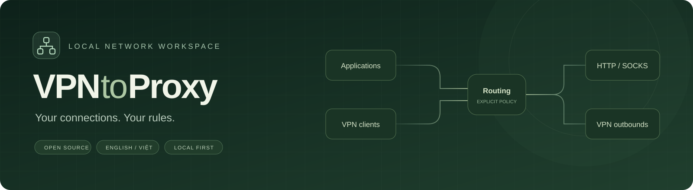
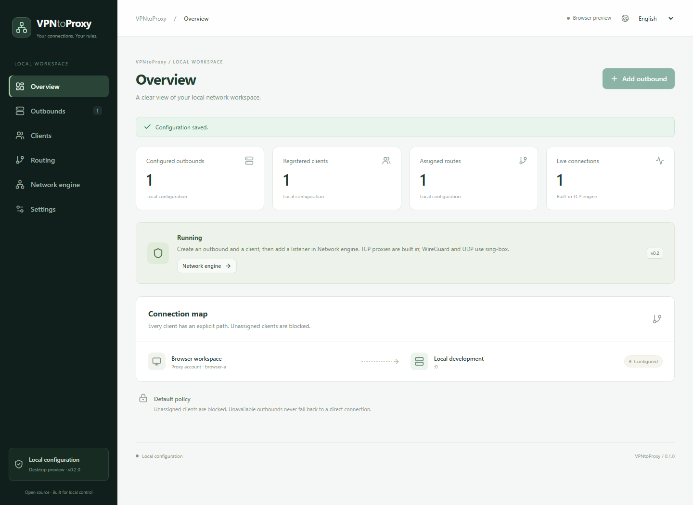
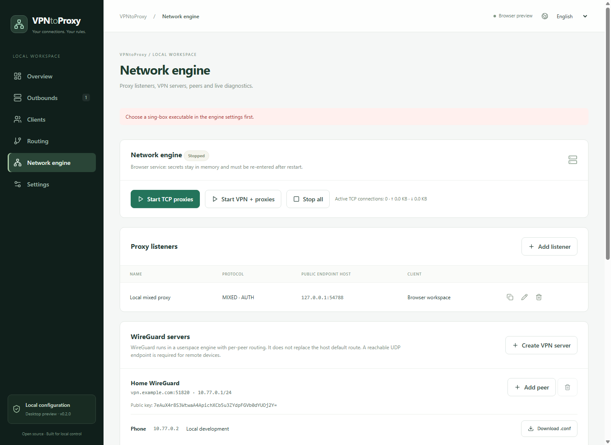
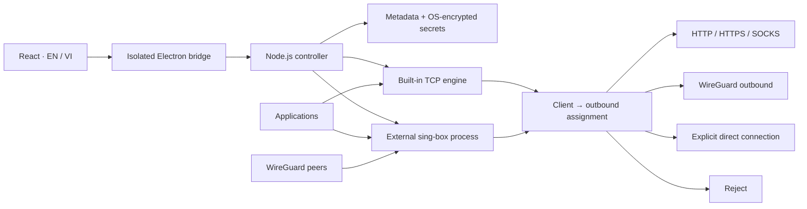

<p align="center"></p>

<p align="center"><strong>A local workspace for proxies, VPN profiles, and per-client routing.</strong><br />One desktop application. Explicit outbound assignments. English and Vietnamese.</p>

<p align="center">
<a href="LICENSE"></a>


</p>

<p align="center"><strong>English</strong> · <a href="README.vi.md">Tiếng Việt</a><br /><a href="#quick-start">Quick start</a> · <a href="#capabilities">Capabilities</a> · <a href="#architecture">Architecture</a> · <a href="CONTRIBUTING.md">Contributing</a></p>

---

## Your network, one workspace

Give each application or device a defined path. Create a proxy listener, assign its client to an outbound, and inspect the result from one interface. The desktop package includes the React frontend and Node.js backend: end users do not need a separate server or Node installation.

- **VPN → proxy:** expose a local proxy backed by a chosen WireGuard outbound.
- **VPN peer → proxy:** receive devices through a WireGuard server and assign each peer to an upstream proxy or VPN.
- **Proxy → proxy:** publish a local HTTP/SOCKS endpoint routed through an upstream proxy, with optional client authentication.

> [!IMPORTANT]
> **v0.2.0 is a desktop preview.** Built-in TCP routing has been tested using real sockets. WireGuard/UDP integration uses an external **sing-box 1.12+** executable with WireGuard/gVisor support, which is not bundled. A local test with **sing-box 1.15.0-alpha.10** verified a WireGuard handshake and SOCKS → VPN → HTTP traffic between two engine processes on one Windows machine. Internet VPN connectivity and leak behavior remain unverified.



| Explicit routes | Local control | Useful diagnostics |
| --- | --- | --- |
| Each client has a named outbound. Unassigned clients are blocked. | Desktop credentials use OS encryption. Metadata exports exclude secrets. | Built-in TCP connection counts, byte counters and the latest 100 events. |

<details>
<summary><strong>Explore the network management screen</strong></summary>



Screenshots use disposable local fixtures. VPN provisioning shown here is configuration, not a live tunnel demonstration.
</details>

## Capabilities

| Feature | Built-in engine | External sing-box integration |
| --- | --- | --- |
| HTTP forward proxy / CONNECT listener | Implemented; socket-tested | Configuration generated |
| SOCKS5 TCP listener and outbound | Implemented; socket-tested | Configuration generated |
| SOCKS4 / SOCKS4a TCP | Implemented; SOCKS4a listener tested | Configuration generated |
| HTTP upstream proxy | Implemented; socket-tested | Configuration generated |
| HTTPS upstream proxy | TLS certificate verification; live compatibility unverified | Configuration generated |
| Direct outbound | Explicit selection only; socket-tested | Configuration generated |
| SOCKS5 UDP | Rejected as unsupported | Requires external engine; unverified |
| WireGuard client/server | Profile import, keypairs, peers, `.conf` export | Userspace endpoints and per-peer rules; local handshake and traffic verified |
| OpenVPN / other encrypted proxy protocols | Not implemented | Future work |

CONNECT tunnels destination TLS without decrypting it. An HTTPS **upstream proxy** additionally encrypts the connection to the proxy. Built-in SOCKS4 outbounds require an IP address; choose SOCKS4a for hostnames. Cross-platform IPv6/VPN leak testing remains outstanding.

## Quick start

### Windows desktop

Run `release/VPNtoProxy-win32-x64/VPNtoProxy.exe` after building or receiving the portable distribution. **Keep the entire folder together.** It contains the packaged frontend, backend and Electron runtime.

There is no published GitHub release yet. The current package is unsigned and does not install a Windows service. Closing the application stops its listeners and child VPN engine.

### From source

Use **Node.js 24** and npm:

```sh
npm ci
npm --prefix frontend ci
npm run build
npm run desktop
```

Run the built interface with the real backend in a browser:

```sh
npm --prefix frontend ci
npm run build
npm start
# Open http://127.0.0.1:47831
```

`npm run dev` starts the frontend-only preview: metadata is stored in local storage, and no listeners can run. The real backend's browser mode keeps secrets **only in memory**; re-enter them after restart. Use desktop mode for encrypted credential persistence.

### Create your first proxy

1. In **Outbounds**, add an HTTP/HTTPS/SOCKS upstream. Choose **Direct** only when the host connection is the intended exit.
2. In **Clients**, create a **Proxy account** and assign its outbound.
3. In **Network engine**, add a listener for that client, such as `127.0.0.1:1080` with protocol **Mixed**.
4. Optionally require a password; the client identity becomes its username. Non-loopback listeners require authentication. SOCKS4 cannot provide password authentication.
5. Select **Start TCP proxies**, then configure your application to use the endpoint.

For a listener without authentication:

```sh
curl --proxy socks5h://127.0.0.1:1080 https://example.com
```

Stop the engine before editing configuration. Stopping disconnects active sessions; live policy migration is not implemented.

## WireGuard setup

Install an official [sing-box build](https://github.com/SagerNet/sing-box/releases) with WireGuard/gVisor support, select its executable in **Network engine**, then press **Validate engine**. The app checks the version and runs `sing-box check` before launch.

**Outbound VPN:** choose **Import WireGuard client**, paste a single-peer profile, and assign a proxy client to it. Imports support one tunnel address and an IP endpoint. Allowed IPs are preserved; shell hooks are rejected.

**VPN server:** choose **Create VPN server**, enter its reachable endpoint, UDP port and tunnel subnet, then add peers. Each peer gets an individual keypair, tunnel IP and outbound assignment. Download its `.conf` for the WireGuard client. Peer exports contain private keys; metadata JSON backups do not.

Select **Start VPN + proxies**. Missing or failing engines produce an error with no direct fallback. Configurations reach the engine over stdin, not a plaintext secret file.

The compiler uses [WireGuard userspace endpoints](https://sing-box.sagernet.org/configuration/endpoint/wireguard/), pins peer source addresses and ends routing with rejection. Destination DNS is configured through the assigned outbound; upstream endpoint discovery may use the host resolver. Local engine startup, handshake and TCP traffic through WireGuard have been tested. DNS/IPv6 isolation, UDP application traffic and remote interoperability still need integration testing. The app does not configure router port forwarding, firewall exceptions or NAT traversal.

## Architecture



| Layer | Current implementation |
| --- | --- |
| Desktop | Electron 37.10.3; context isolation, sandboxed preload, no renderer Node access |
| Frontend | React 19, TypeScript, Vite, Lucide, responsive CSS |
| Backend | Node.js networking APIs; no production npm backend dependencies |
| VPN adapter | External sing-box process; configuration checked before launch |
| Persistence | Validated JSON, serialized writes, temporary-file replacement |
| Secrets | Electron `safeStorage`, backed by OS encryption on Windows |
| Localization | Typed EN/VI catalogs with key-parity tests |
| Verification | Vitest, Node test runner, socket fixtures, Chromium workflows |

The original Go/Wails prototype is preserved in [`archive/go-wails`](archive/go-wails/README.md); it is not used by the current package. SQLite, i18next and a background service remain future options.

```text
desktop/           Electron shell and isolated preload
frontend/src/      Management UI, translations, frontend tests
server/            Controller, secret store, proxies, VPN adapter
server/test/       Loopback network and configuration tests
tools/             Packaging and browser verification
docs/assets/       Original banner and real application screenshots
archive/go-wails/  Historical configuration-only prototype
```

## Verify and package

```sh
npm test
npm run test:vpn-local
npm run build
npm run package:win
```

Packaging uses installed Electron. For offline builds, set `ELECTRON_ZIP` to an official Electron 37.10.3 Windows x64 archive. The portable folder under `release/` retains runtime and frontend license notices.

The local VPN test uses `tools/sing-box/sing-box.exe` by default, or `SING_BOX_PATH` if set. It runs two sing-box processes and a local HTTP target, then checks that a SOCKS request crosses the WireGuard tunnel. It needs a non-loopback local IPv4 address and does not contact an internet VPN.

Browser workflow test:

```powershell
$env:CHROME_PATH = 'C:\Program Files\Google\Chrome\Application\chrome.exe'
node tools/smoke-runtime.mjs
```

This launches a disposable backend, drives the UI, transfers data through an authenticated SOCKS5 listener, checks persistence and VPN provisioning, and refreshes screenshots. It does **not** verify internet VPN connectivity. Test data stays in ignored `.tools/`.

Production readiness still requires remote WireGuard/UDP interoperability, external-engine telemetry, platform leak tests, broader protocol hardening and an installer/update strategy. Windows is the packaged target; macOS/Linux packaging is unverified.

## Contribute and license

Reports, protocol tests, translations and pull requests in **English or Vietnamese** are welcome. See [CONTRIBUTING.md](CONTRIBUTING.md). Keep both READMEs and catalogs aligned; never attach passwords, private keys or unredacted peer files to issues.

Application code is [MIT licensed](LICENSE). See [THIRD_PARTY_NOTICES.md](THIRD_PARTY_NOTICES.md) for Electron/frontend attribution. The separately installed engine retains its upstream license.
