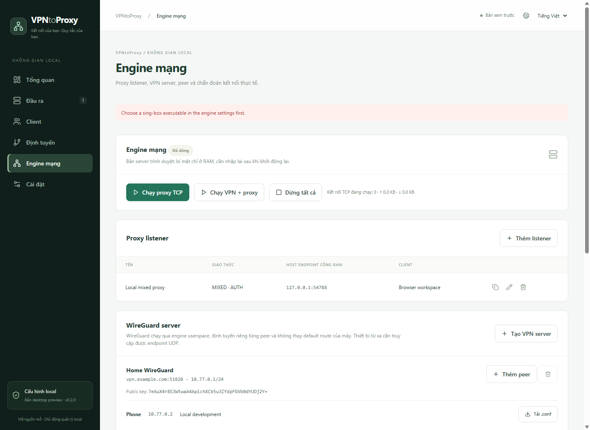
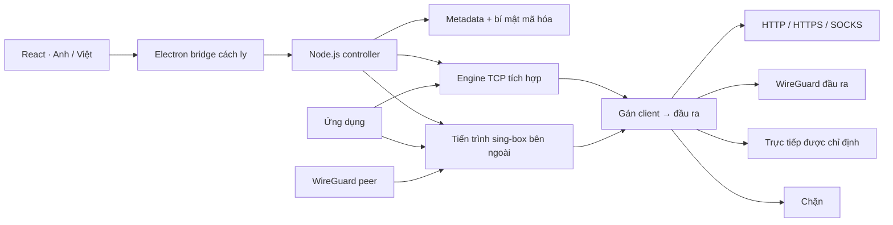

<p align="center"></p>

<p align="center"><strong>Không gian local quản lý proxy, profile VPN và đường đi của từng client.</strong><br />Một ứng dụng desktop. Đầu ra được gán rõ ràng. Giao diện Anh và Việt.</p>

<p align="center">
<a href="LICENSE"></a>


</p>

<p align="center"><a href="README.md">English</a> · <strong>Tiếng Việt</strong><br /><a href="#bắt-đầu">Bắt đầu</a> · <a href="#tính-năng">Tính năng</a> · <a href="#kiến-trúc">Kiến trúc</a> · <a href="CONTRIBUTING.md">Đóng góp</a></p>

---

## Quản lý mạng trong một không gian

Gán cho mỗi ứng dụng hoặc thiết bị một đường mạng xác định. Tạo proxy listener, chọn đầu ra cho client và theo dõi kết quả trong cùng giao diện. Bản desktop đóng gói frontend React cùng backend Node.js: người dùng không cần cài server hay Node riêng.

- **VPN → proxy:** xuất proxy local đi qua WireGuard đầu ra được chọn.
- **VPN peer → proxy:** nhận thiết bị qua WireGuard server, gán từng peer vào upstream proxy hoặc VPN.
- **Proxy → proxy:** mở endpoint HTTP/SOCKS local qua upstream proxy, có thể bật xác thực client.

> [!IMPORTANT]
> **v0.2.0 là bản desktop preview.** Proxy TCP tích hợp đã được kiểm thử bằng socket thật. WireGuard/UDP dùng **sing-box 1.12+** có WireGuard/gVisor cài riêng, chưa đóng gói kèm. Bài thử local với **sing-box 1.15.0-alpha.10** đã xác nhận handshake WireGuard và lưu lượng SOCKS → VPN → HTTP giữa hai tiến trình engine trên cùng máy Windows. Kết nối VPN internet và kiểm tra rò rỉ vẫn chưa được xác minh.


| Định tuyến rõ ràng | Chủ động ở local | Chẩn đoán thiết thực |
| --- | --- | --- |
| Mỗi client có đầu ra riêng. Client chưa được gán bị chặn. | Desktop mã hóa thông tin xác thực bằng hệ điều hành. Metadata xuất ra không chứa bí mật. | Số kết nối TCP, bộ đếm lưu lượng và 100 sự kiện gần nhất. |

<details>
<summary><strong>Xem giao diện quản lý mạng tiếng Việt</strong></summary>



Ảnh dùng dữ liệu kiểm thử local dùng một lần. Phần WireGuard là cấu hình, không phải minh chứng tunnel đang hoạt động.
</details>

## Tính năng

| Khả năng | Engine tích hợp | Tích hợp sing-box bên ngoài |
| --- | --- | --- |
| HTTP forward proxy / CONNECT listener | Đã triển khai, kiểm thử socket | Đã sinh cấu hình |
| SOCKS5 TCP listener và đầu ra | Đã triển khai, kiểm thử socket | Đã sinh cấu hình |
| SOCKS4 / SOCKS4a TCP | Đã triển khai; đã kiểm thử listener SOCKS4a | Đã sinh cấu hình |
| Upstream HTTP proxy | Đã triển khai, kiểm thử socket | Đã sinh cấu hình |
| Upstream HTTPS proxy | Có xác minh chứng chỉ TLS; chưa kiểm chứng tương thích thực tế | Đã sinh cấu hình |
| Đầu ra trực tiếp | Chỉ dùng khi chỉ định rõ; đã kiểm thử socket | Đã sinh cấu hình |
| SOCKS5 UDP | Trả lỗi chưa hỗ trợ | Cần engine ngoài; chưa kiểm chứng |
| WireGuard client/server | Nhập profile, tạo khóa/peer, xuất `.conf` | Endpoint userspace, rule theo peer; đã kiểm chứng handshake và lưu lượng local |
| OpenVPN / proxy mã hóa khác | Chưa triển khai | Phát triển sau |

CONNECT tạo tunnel mà không giải mã TLS của đích. **Upstream HTTPS proxy** thêm TLS cho kết nối đến proxy. Đầu ra SOCKS4 tích hợp yêu cầu IP; chọn SOCKS4a khi cần hostname. Kiểm thử rò rỉ IPv6/VPN trên các nền tảng vẫn chưa hoàn tất.

## Bắt đầu

### Desktop Windows

Chạy `release/VPNtoProxy-win32-x64/VPNtoProxy.exe` sau khi build hoặc nhận bộ portable. **Giữ nguyên cả thư mục** vì bên trong có frontend, backend và Electron runtime.

Chưa có bản phát hành trên GitHub. Bản hiện tại chưa ký số, chưa cài Windows service. Đóng ứng dụng sẽ dừng listener và tiến trình engine VPN do ứng dụng khởi chạy.

### Chạy từ mã nguồn

Dùng **Node.js 24** và npm:

```sh
npm ci
npm --prefix frontend ci
npm run build
npm run desktop
```

Chạy UI trình duyệt với backend thật:

```sh
npm --prefix frontend ci
npm run build
npm start
# Mở http://127.0.0.1:47831
```

`npm run dev` là preview frontend: chỉ lưu metadata trong local storage, không chạy listener. Backend ở chế độ trình duyệt giữ bí mật **chỉ trong RAM**, cần nhập lại sau khi khởi động lại. Dùng desktop để lưu thông tin xác thực được mã hóa.

### Tạo proxy đầu tiên

1. Trong **Đầu ra**, thêm upstream HTTP/HTTPS/SOCKS. Chọn **Trực tiếp** chỉ khi muốn dùng đường mạng của chính máy này.
2. Trong **Client**, tạo **Tài khoản proxy** và gán đầu ra.
3. Trong **Engine mạng**, thêm listener cho client, ví dụ `127.0.0.1:1080`, giao thức **Mixed**.
4. Nếu bật mật khẩu, định danh client là tên đăng nhập. Listener ngoài loopback phải xác thực; SOCKS4 không có xác thực mật khẩu.
5. Chọn **Chạy proxy TCP**, sau đó cấu hình ứng dụng dùng endpoint.

Ví dụ listener không yêu cầu xác thực:

```sh
curl --proxy socks5h://127.0.0.1:1080 https://example.com
```

Dừng engine trước khi sửa cấu hình. Thao tác dừng ngắt các phiên đang chạy; chưa có chuyển chính sách trực tiếp cho phiên hiện hữu.

## Thiết lập WireGuard

Cài [sing-box chính thức](https://github.com/SagerNet/sing-box/releases) có WireGuard/gVisor, chọn file thực thi trong **Engine mạng** rồi bấm **Kiểm tra engine**. Ứng dụng kiểm tra phiên bản và chạy `sing-box check` trước khi khởi chạy.

**VPN đầu ra:** chọn **Nhập WireGuard client**, dán profile một peer rồi gán client proxy vào đầu ra đó. Hỗ trợ một địa chỉ tunnel và endpoint dạng IP. Allowed IPs được giữ nguyên; profile có shell hook bị từ chối.

**VPN server:** chọn **Tạo VPN server**, điền endpoint có thể truy cập, cổng UDP và subnet tunnel rồi thêm peer. Mỗi peer có cặp khóa, IP tunnel và đầu ra riêng. Tải `.conf` cho WireGuard client. File peer chứa private key; bản sao lưu metadata JSON không chứa khóa này.

Chọn **Chạy VPN + proxy**. Thiếu hoặc lỗi engine sẽ báo lỗi, không tự chuyển sang đường trực tiếp. Cấu hình được truyền qua stdin, không ghi thành file chứa bí mật rõ.

Bộ sinh cấu hình dùng [WireGuard userspace endpoint](https://sing-box.sagernet.org/configuration/endpoint/wireguard/), gắn peer với IP nguồn và kết thúc bằng rule chặn. DNS đích được cấu hình qua đầu ra đã gán; việc tìm endpoint upstream có thể dùng resolver của máy. Đã kiểm thử khởi động engine, handshake và lưu lượng TCP qua WireGuard ở local. Cách ly DNS/IPv6, lưu lượng UDP ứng dụng và khả năng tương tác với VPN từ xa vẫn cần kiểm thử tích hợp. Ứng dụng không tự cấu hình port forwarding, firewall hoặc NAT traversal.

## Kiến trúc



| Thành phần | Triển khai hiện tại |
| --- | --- |
| Desktop | Electron 37.10.3; context isolation, preload sandbox, renderer không có Node |
| Frontend | React 19, TypeScript, Vite, Lucide, CSS responsive |
| Backend | API mạng Node.js; không có dependency npm production cho backend |
| VPN adapter | Tiến trình sing-box ngoài; kiểm tra cấu hình trước khi chạy |
| Lưu trữ | JSON có validation, ghi tuần tự, thay thế qua file tạm |
| Bí mật | Electron `safeStorage`, mã hóa bằng hệ điều hành trên Windows |
| Đa ngôn ngữ | Bộ từ điển Anh/Việt có kiểu, kiểm thử đồng bộ khóa |
| Kiểm chứng | Vitest, Node test runner, socket fixture, thao tác Chromium |

Prototype Go/Wails cũ nằm tại [`archive/go-wails`](archive/go-wails/README.md), không tham gia bản đóng gói hiện tại. SQLite, i18next và dịch vụ nền là hướng phát triển sau.

```text
desktop/           Electron và preload cách ly
frontend/src/      UI quản lý, bản dịch, kiểm thử frontend
server/            Controller, lưu bí mật, proxy, VPN adapter
server/test/       Kiểm thử mạng loopback và cấu hình
tools/             Đóng gói và kiểm chứng trình duyệt
docs/assets/       Banner riêng và ảnh ứng dụng thật
archive/go-wails/  Prototype quản lý cấu hình cũ
```

## Kiểm thử và đóng gói

```sh
npm test
npm run test:vpn-local
npm run build
npm run package:win
```

Đóng gói dùng Electron đã cài. Build offline có thể đặt `ELECTRON_ZIP` trỏ đến archive Electron 37.10.3 Windows x64 chính thức. Thư mục portable trong `release/` giữ thông báo giấy phép runtime và frontend.

Bài thử VPN local mặc định dùng `tools/sing-box/sing-box.exe`, hoặc biến `SING_BOX_PATH` nếu đã đặt. Script chạy hai tiến trình sing-box và một HTTP target trên máy, rồi kiểm tra request SOCKS đi qua tunnel WireGuard. Cần một địa chỉ IPv4 local không phải loopback; bài thử không kết nối VPN internet.

Kiểm thử UI:

```powershell
$env:CHROME_PATH = 'C:\Program Files\Google\Chrome\Application\chrome.exe'
node tools/smoke-runtime.mjs
```

Script mở backend dùng một lần, thao tác UI, truyền dữ liệu qua SOCKS5 có xác thực, kiểm tra lưu cấu hình/tạo peer và cập nhật ảnh tài liệu. Script **không** xác nhận VPN internet. Dữ liệu kiểm thử nằm trong `.tools/` được Git bỏ qua.

Trước production cần kiểm thử WireGuard/UDP từ xa, telemetry engine ngoài, kiểm tra rò rỉ, kiểm thử giao thức rộng hơn và installer/cập nhật. Windows là nền tảng đã đóng gói; macOS/Linux chưa được kiểm chứng đóng gói.

## Đóng góp và giấy phép

Chào đón báo lỗi, kiểm thử giao thức, bản dịch và pull request bằng **tiếng Anh hoặc tiếng Việt**. Xem [CONTRIBUTING.md](CONTRIBUTING.md). Giữ README/bộ từ điển đồng bộ; không đính kèm mật khẩu, private key hoặc cấu hình peer chưa che bí mật vào issue.

Mã ứng dụng dùng [giấy phép MIT](LICENSE). Xem [THIRD_PARTY_NOTICES.md](THIRD_PARTY_NOTICES.md) để biết thông tin ghi công Electron/frontend. Engine cài riêng giữ giấy phép upstream.
