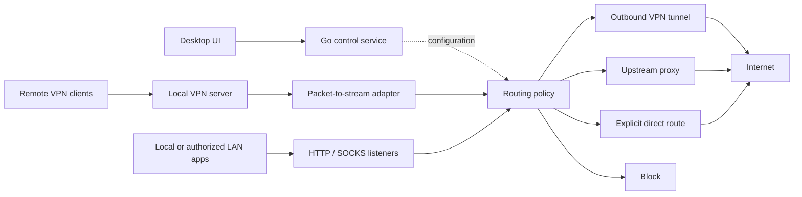

# VPNtoProxy

**Run a VPN server and VPN clients on your local machine, expose proxy endpoints, and control which client uses which outbound connection.**

English | [Tiếng Việt](README.vi.md)

[Project repository](https://github.com/cuongtechnology/VPN-to-Proxy/)

> **Status: configuration foundation (v0.1.0).** The React interface manages outbound endpoint metadata, clients, and assignments, with English/Vietnamese UI and JSON export. A Go configuration backend and Wails entry point are included. The VPN/proxy traffic engine is not implemented: no tunnel, proxy listener, or live forwarding is available yet. The architecture and protocol tables below remain the target design.

## Run the current build

Requires Node.js 22.12+ or a supported newer release, with npm.

```sh
npm --prefix frontend ci
npm run dev
```

Open the loopback URL printed by Vite. Browser preview stores non-secret configuration in that browser's local storage; it starts empty. Add an outbound, add a client, then assign its outbound from the Clients page. The Routing page previews assignments, not live traffic. Use Settings to change language or export JSON. Use one application tab/window when editing; cross-instance synchronization is not implemented.

```sh
npm test
npm run build
```

For the browser smoke test, start the dev server, set `CHROME_PATH` to a Chromium executable, then run `node tools/smoke-browser.mjs`. `SMOKE_ORIGIN` overrides the default `http://127.0.0.1:5173`. It creates a separate browser profile under ignored `.tools/`, exercises configuration workflows, and captures desktop/mobile screenshots there. This does not test actual network forwarding.

The repository also includes a Wails desktop entry point and Go configuration/routing packages. Desktop requires Go and the [Wails platform prerequisites](https://wails.io/docs/gettingstarted/installation/), including WebView2 on Windows. After installing those prerequisites:

```sh
go mod tidy
go install github.com/wailsapp/wails/v2/cmd/wails@v2.15.0
wails dev
# Package the desktop executable:
wails build
# Test configuration persistence and policy:
go test ./internal/...
```

Go/Wails are not available in the initial development environment, so the desktop build and Go tests have not yet been verified. `go mod tidy` will generate `go.sum`; review and commit it before setting up reproducible desktop CI. Desktop configuration is designed to live at `os.UserConfigDir()/VPNtoProxy/config.json` (normally `%AppData%/VPNtoProxy/config.json` on Windows).

Current implementation uses plain CSS, typed English/Vietnamese dictionaries, browser local storage for preview, and a validated JSON file for desktop configuration. Tailwind/Radix, i18next, SQLite, OS secret storage, a background service, and network adapters remain planned. No credentials should be entered into metadata fields. Go file replacement behavior still needs Windows integration validation.

## Vision

VPNtoProxy is a planned open-source desktop application that packages its frontend and backend together. Users manage VPN servers, outbound VPN connections, proxy listeners, upstream proxies, and client routing from one local interface.

The same machine can accept incoming VPN peers and establish outbound VPN tunnels at the same time. A proxy endpoint is the primary output: applications can consume an HTTP or SOCKS proxy without managing the underlying VPN themselves.

Two complementary workflows are planned:

1. **VPN to proxy:** connect the local machine to a remote VPN, then expose a local proxy whose traffic exits through that specific VPN tunnel.
2. **VPN client to upstream proxy:** accept devices through the local VPN server and route each device's traffic through its assigned upstream proxy or outbound VPN.

A VPN peer is not automatically an internet exit node. Using a remote peer as an exit requires forwarding and routing/NAT on that peer. Hosting a publicly reachable local VPN server also requires a reachable UDP endpoint or suitable port forwarding; NAT traversal and relays are outside the first milestone.

## Proposed stack

| Layer | Choice | Purpose |
| --- | --- | --- |
| Desktop shell | Wails v2 | Package the Go backend and web frontend as a desktop application |
| Frontend | React + TypeScript + Vite | Typed management UI and frontend build pipeline |
| UI | Tailwind CSS + Radix UI primitives | Styling and accessible controls |
| Localization | i18next + react-i18next | English/Vietnamese UI and extensible locale catalogs |
| Backend | Go | Configuration, networking orchestration, routing policy, and lifecycle management |
| VPN | WireGuard first; OpenVPN later | Inbound VPN server and outbound VPN client profiles |
| Proxy engine | Go listeners/dialers behind protocol adapters | HTTP CONNECT and SOCKS5 first; additional protocols incrementally |
| Packet-to-stream adapter | Evaluated userspace TCP/IP stack behind an interface | Convert packets from VPN peers into TCP/UDP flows for proxy routing |
| Persistence | SQLite + versioned migrations | Profiles, clients, routing rules, settings, and bounded audit history |
| Secrets | OS credential store | Keep VPN private keys and upstream credentials separate from ordinary configuration |
| Local control | Wails bindings; authenticated local IPC for the service | UI operations and privileged network management |
| Diagnostics | Go structured logging and bounded local metrics | Connection status, traffic counters, and actionable errors |
| Verification | Go tests, Vitest, frontend component tests, network integration tests | Validate policy, UI behavior, and actual egress isolation |
| Automation | GitHub Actions | Build, lint, test, and produce platform-specific release artifacts |

These choices are proposed, with dependency versions pinned when the application is scaffolded. Wails supports Go/web desktop applications and bundled assets through the platform webview; platform runtimes and network components still need installer handling. See the [Wails documentation](https://wails.io/docs/introduction/). WireGuard provides the VPN tunnel; application-level provisioning and proxy conversion remain VPNtoProxy responsibilities. See [WireGuard](https://www.wireguard.com/).

The packet-to-stream implementation is an early technical decision, not a completed dependency selection. Evaluate maintained libraries or an external engine for Windows compatibility, UDP behavior, resource use, and redistribution terms before committing to one. Do not build custom VPN cryptography.

## Architecture



The UI manages configuration; the networking service carries traffic. Package both in one installer, with a service/helper where OS networking requires elevated privileges. The desktop UI should run without elevation, and closing it should not stop an explicitly enabled background service.

WireGuard carries IP packets, while HTTP and SOCKS proxies handle supported transport flows. VPN-to-proxy forwarding therefore requires a packet-to-stream adapter: changing a default route alone cannot send arbitrary VPN traffic through an HTTP proxy. Unsupported traffic, including ICMP over ordinary HTTP/SOCKS connections, must be handled explicitly or rejected.

Each outbound VPN needs an isolated dialing/routing context. Avoid replacing the host's default route whenever a profile connects. The implementation must also keep VPN endpoint traffic outside its own tunnel, preserve return paths, and prevent routing loops. Platform-specific networking adapters require separate validation on Windows, Linux, and macOS.

## Client assignment and routing

The application distinguishes:

- **VPN peers:** devices authenticated by their VPN keys, with allowed tunnel addresses.
- **Proxy consumers:** applications/users identified by listener and, where supported, proxy credentials. A shared local source IP cannot identify individual applications reliably.
- **Outbounds:** a named VPN tunnel, upstream proxy, explicit direct connection, or block action.

Example assignments, illustrating design rather than an executable configuration:

| Client identity | Ingress | Assignment | Expected path |
| --- | --- | --- | --- |
| Browser profile A | SOCKS5 listener `127.0.0.1:1080`, user `browser-a` | `vpn-office` | Browser → local proxy → VPN → internet |
| Phone A | WireGuard peer `phone-a` | `proxy-sg` | Phone → local VPN server → upstream SOCKS5 → internet |
| Laptop B | WireGuard peer `laptop-b` | `proxy-jp` | Laptop → local VPN server → upstream HTTP CONNECT → internet |

Planned policy behavior:

- Evaluate enabled rules in explicit order; first matching rule wins. Reject unmatched traffic by default.
- Match peer identity, listener, proxy account, destination CIDR/port, and transport. Domain rules apply only where a hostname is available or reliably associated with DNS; IP-only traffic must not be assumed to have a known hostname.
- Allow multiple clients to share an outbound, with optional per-client limits.
- Keep existing flows on their selected outbound; rule changes apply to new flows unless the user explicitly disconnects active sessions.
- If an assigned outbound fails, block traffic by default. Failover requires an explicit configured policy, with no silent direct fallback.
- Bind DNS resolution to the selected outbound policy. IPv6 must use a validated route or be blocked; it must not bypass IPv4 policy.
- Record rule decisions and connection metadata with secret redaction and configurable retention, without logging traffic payloads by default.

## Planned protocol coverage

All entries below are roadmap scope, not current support.

| Protocol | Local listener / server | Outbound | Target |
| --- | --- | --- | --- |
| HTTP forward proxy + CONNECT | Yes | Yes | MVP, TCP |
| SOCKS5 CONNECT | Yes | Yes | MVP, TCP |
| WireGuard | VPN server | VPN client | MVP |
| SOCKS5 UDP ASSOCIATE | Planned | Planned | After TCP routing is verified |
| HTTPS proxy (TLS to the proxy) | Planned | Planned | After MVP |
| SOCKS4 / SOCKS4a | Planned | Planned | Compatibility milestone, TCP only |
| OpenVPN | Planned | Planned | Later milestone |
| Additional encrypted proxy protocols | Under evaluation | Under evaluation | Separate adapters after core stabilization |

HTTP CONNECT can tunnel HTTPS destinations without decrypting their TLS. An HTTPS proxy additionally protects the connection to the proxy itself. TLS interception is outside the intended scope. UDP works only when every component in the chosen path supports it; HTTP CONNECT and SOCKS4 are not general UDP transports.

## Planned management interface

- Dashboard: service state, active tunnels, peers, proxy listeners, throughput, and errors.
- VPN server: endpoint settings, peer provisioning, revocation, and configuration export.
- VPN clients: import profiles, connect/disconnect, reconnect policy, and health state.
- Proxies: listener bind addresses, authentication, upstream credentials, and connectivity checks.
- Routing: client-to-outbound assignments, ordered rules, and a preview of matching decisions.
- Diagnostics: bounded connection history, DNS checks, and observed egress per outbound.
- Settings: language, startup/background service, backups, and log retention.

Proxy listeners bind to loopback by default. LAN exposure requires an explicit bind configuration and access controls. The VPN server has its own intentional listen address and firewall rules. Authenticate service IPC and restrict it to authorized local users; do not expose the management interface publicly by default.

## English, Vietnamese, and additional languages

English (`en`) and Vietnamese (`vi`) are the primary documentation and UI languages. English is the fallback locale. Users can switch language independently of the OS locale.

Planned catalogs live under `frontend/src/locales/{locale}/`, grouped into namespaces such as `common`, `vpn`, `proxy`, `routing`, and `errors`. Use stable translation keys, locale-aware number/date formatting, and proper pluralization. Backend errors carry stable codes and parameters; the frontend renders localized messages. Technical identifiers and protocol names remain unchanged.

New languages can be contributed by adding a locale catalog and registering it in the language selector. CI should check missing keys and interpolation placeholders. See [i18next documentation](https://www.i18next.com/) for the localization foundation.

## Proposed repository layout

```text
VPN-to-Proxy/
├── frontend/src/
│   ├── components/
│   ├── features/           # VPN, proxy, routing, diagnostics
│   └── locales/            # en, vi, additional locales
├── cmd/
│   ├── desktop/            # Wails entry point
│   └── service/            # Networking service entry point
├── internal/
│   ├── vpn/                # VPN server/client adapters
│   ├── proxy/              # Listeners and outbound dialers
│   ├── netstack/           # Packet-to-stream adapter
│   ├── routing/            # Identity, rules, DNS, isolation
│   ├── platform/           # OS networking and service integration
│   ├── storage/            # SQLite and migrations
│   └── secrets/            # OS credential-store integration
├── migrations/
├── tests/integration/
├── docs/
├── build/                  # Installer resources
├── README.md
└── README.vi.md
```

The tree above describes the target layout. The current Wails entry point is at the repository root (`main.go`, `app.go`); implemented Go packages are `internal/config` and `internal/routing`. Frontend source is under `frontend/src`. The remaining directories will be introduced with their implementations. A future installer should bundle the application and required networking components without requiring Node.js or Go on the user's machine.

## Roadmap and acceptance criteria

- [ ] **Networking proof of concept:** on Windows, demonstrate two simultaneous VPN outbounds with separate proxy listeners and distinct verified egress paths. Demonstrate an inbound VPN peer routed through an upstream proxy via the packet adapter.
- [ ] **Desktop foundation:** scaffold Go/Wails/React, English/Vietnamese catalogs, persistence, secret storage, and service lifecycle.
- [ ] **TCP MVP:** WireGuard server/client, HTTP and SOCKS5 TCP listeners/outbounds, peer/account assignment, and visible connection state.
- [ ] **Isolation verification:** test cross-client separation, DNS routing, IPv6 behavior, endpoint loop prevention, and tunnel failure without direct leakage.
- [ ] **Protocol expansion:** SOCKS5 UDP, TLS-protected proxy connections, SOCKS4/4a, and evaluated OpenVPN integration.
- [ ] **Distribution:** installer, clean install/upgrade/uninstall checks, dependency notices, and documented releases. Expand to Linux/macOS after platform tests pass.

Critical integration tests must inspect the actual egress path for at least two clients, revoke a peer, take down an assigned outbound, and confirm denied traffic does not fall back to the host connection. Tests should also verify service restart recovery and removal of application-owned routes/firewall rules during uninstall.

## Contributing and licensing

Contributions in English or Vietnamese are welcome: architecture feedback, protocol adapters, platform testing, UI improvements, translations, and documentation. Keep both primary READMEs aligned when behavior or scope changes. Discuss major networking changes in a repository issue before implementation; pull requests should describe behavior and relevant verification.

VPNtoProxy is intended to be open source. The project license has not been selected in this proposal; add the maintainer-approved `LICENSE` before distributing code. Review the redistribution requirements of every bundled VPN component, driver, library, and frontend dependency, and ship their required notices. This README does not grant a software license.
