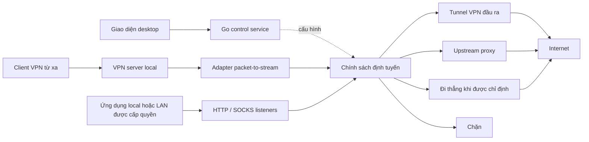

# VPNtoProxy

**Chạy VPN server và VPN client ngay trên máy local, xuất đầu ra proxy và quản lý từng client sử dụng kết nối đầu ra nào.**

[English](README.md) | Tiếng Việt

[Kho mã nguồn dự án](https://github.com/cuongtechnology/VPN-to-Proxy/)

> **Trạng thái: nền tảng quản lý cấu hình (v0.1.0).** UI React quản lý metadata endpoint đầu ra, client và gán đường đi, có Anh/Việt và xuất JSON. Đã có mã backend cấu hình Go và điểm vào Wails. Chưa triển khai engine VPN/proxy: chưa có tunnel, proxy listener hay chuyển tiếp lưu lượng thực tế. Kiến trúc và bảng giao thức bên dưới vẫn là thiết kế mục tiêu.

## Chạy bản hiện tại

Cần Node.js 22.12+ hoặc bản mới hơn được hỗ trợ, kèm npm.

```sh
npm --prefix frontend ci
npm run dev
```

Mở URL loopback do Vite in ra. Bản trình duyệt lưu cấu hình không chứa bí mật trong local storage của trình duyệt và khởi đầu với dữ liệu trống. Thêm đầu ra, thêm client rồi gán đầu ra tại trang Client. Trang Định tuyến xem trước cấu hình đường đi, không phải lưu lượng đang chạy. Trang Cài đặt cho phép đổi ngôn ngữ và xuất JSON. Chỉ dùng một tab/cửa sổ khi chỉnh sửa; chưa có đồng bộ giữa nhiều phiên ứng dụng.

```sh
npm test
npm run build
```

Để kiểm thử trình duyệt, bật dev server, đặt `CHROME_PATH` trỏ tới file thực thi Chromium rồi chạy `node tools/smoke-browser.mjs`. `SMOKE_ORIGIN` cho phép đổi URL mặc định `http://127.0.0.1:5173`. Script tạo profile trình duyệt riêng trong `.tools/` được bỏ qua bởi Git, kiểm tra các thao tác cấu hình và chụp giao diện desktop/mobile vào đó. Kiểm thử này không kiểm chứng chuyển tiếp lưu lượng thực tế.

Repository có điểm vào desktop Wails và các package Go quản lý cấu hình/định tuyến. Desktop cần Go và [điều kiện nền tảng của Wails](https://wails.io/docs/gettingstarted/installation/), bao gồm WebView2 trên Windows. Sau khi cài đủ công cụ:

```sh
go mod tidy
go install github.com/wailsapp/wails/v2/cmd/wails@v2.15.0
wails dev
# Đóng gói file thực thi desktop:
wails build
# Kiểm tra lưu cấu hình và chính sách:
go test ./internal/...
```

Môi trường phát triển ban đầu chưa có Go/Wails nên chưa kiểm chứng build desktop và Go tests. `go mod tidy` sẽ tạo `go.sum`; cần kiểm tra và commit file này trước khi thiết lập CI desktop có thể tái lập. Cấu hình desktop dự kiến nằm tại `os.UserConfigDir()/VPNtoProxy/config.json`, thường là `%AppData%/VPNtoProxy/config.json` trên Windows.

Bản hiện tại dùng CSS thuần, bộ từ điển Anh/Việt có kiểm tra kiểu, local storage cho preview và file JSON có validation cho desktop. Tailwind/Radix, i18next, SQLite, kho bí mật hệ điều hành, dịch vụ nền và adapter mạng vẫn thuộc kế hoạch. Không nhập thông tin xác thực vào các trường metadata. Cần kiểm chứng thao tác thay file cấu hình Go trên Windows.

## Mục tiêu

VPNtoProxy là ứng dụng desktop mã nguồn mở dự kiến đóng gói cả frontend và backend. Người dùng quản lý VPN server, kết nối VPN đầu ra, proxy listener, upstream proxy và quy tắc định tuyến trong một giao diện local.

Một máy có thể đồng thời nhận các thiết bị kết nối vào VPN server và chạy VPN client kết nối đến VPN bên ngoài. Đầu ra chính là các endpoint proxy: ứng dụng sử dụng HTTP hoặc SOCKS mà không cần tự quản lý VPN bên dưới.

Hai luồng sử dụng chính:

1. **VPN thành proxy:** máy local kết nối đến VPN từ xa, sau đó mở proxy local có lưu lượng đi qua đúng tunnel VPN đó.
2. **Client VPN qua upstream proxy:** thiết bị kết nối vào VPN server local; lưu lượng của từng thiết bị đi qua upstream proxy hoặc VPN đầu ra được chỉ định.

Một VPN peer không tự động trở thành điểm thoát internet. Peer được dùng làm điểm thoát cần cấu hình forwarding và routing/NAT. VPN server local nhận kết nối từ internet cần endpoint UDP truy cập được hoặc port forwarding phù hợp; NAT traversal và relay nằm ngoài mốc đầu tiên.

## Stack đề xuất

| Thành phần | Công nghệ | Vai trò |
| --- | --- | --- |
| Vỏ ứng dụng desktop | Wails v2 | Đóng gói backend Go và frontend web thành ứng dụng desktop |
| Frontend | React + TypeScript + Vite | Giao diện quản lý có kiểm tra kiểu và công cụ build |
| UI | Tailwind CSS + Radix UI primitives | Giao diện và các thành phần hỗ trợ accessibility |
| Đa ngôn ngữ | i18next + react-i18next | Tiếng Anh/Việt và mở rộng các bộ bản dịch |
| Backend | Go | Cấu hình, điều phối kết nối mạng, định tuyến và vòng đời dịch vụ |
| VPN | WireGuard trước; OpenVPN sau | VPN server nhận kết nối và VPN client đầu ra |
| Proxy engine | Listener/dialer Go qua các adapter giao thức | HTTP CONNECT và SOCKS5 trước, mở rộng dần |
| Adapter packet-to-stream | TCP/IP stack userspace được đánh giá riêng | Chuyển gói IP từ VPN peer thành luồng TCP/UDP để đi qua proxy |
| Lưu trữ | SQLite + migration có phiên bản | Profile, client, quy tắc, cài đặt và lịch sử giới hạn dung lượng |
| Lưu bí mật | Kho thông tin xác thực của hệ điều hành | Tách private key và mật khẩu khỏi cấu hình thông thường |
| Điều khiển local | Wails bindings; IPC local có xác thực cho service | Thao tác từ UI và quản lý mạng cần quyền cao |
| Chẩn đoán | Structured logging của Go và metrics local có giới hạn | Trạng thái kết nối, lưu lượng và lỗi có thể xử lý |
| Kiểm chứng | Go tests, Vitest, kiểm thử component và tích hợp mạng | Kiểm tra chính sách, UI và đường ra thực tế |
| Tự động hóa | GitHub Actions | Build, lint, test và tạo bản phát hành từng nền tảng |

Đây là stack đề xuất; phiên bản dependency sẽ được khóa khi tạo khung ứng dụng. Wails hỗ trợ desktop Go/web và đóng gói tài nguyên frontend, sử dụng webview của nền tảng; installer vẫn cần xử lý runtime và thành phần mạng cần thiết. Xem [tài liệu Wails](https://wails.io/docs/introduction/). WireGuard cung cấp tunnel VPN; quản lý cấu hình và chuyển đổi sang proxy là trách nhiệm của VPNtoProxy. Xem [WireGuard](https://www.wireguard.com/).

Thư viện packet-to-stream chưa được chốt. Cần đánh giá thư viện hoặc engine có bảo trì về tương thích Windows, UDP, tài nguyên và điều kiện phân phối trước khi chọn. Không tự xây dựng thuật toán mã hóa VPN.

## Kiến trúc



UI quản lý cấu hình; dịch vụ mạng xử lý lưu lượng. Đóng gói chung trong một installer, có service/helper cho các thao tác mạng cần quyền cao. UI chạy với quyền người dùng thông thường; đóng cửa sổ không làm dừng dịch vụ nền đã được người dùng bật.

WireGuard truyền gói IP, còn proxy HTTP/SOCKS xử lý các luồng transport mà giao thức hỗ trợ. Vì vậy cần adapter packet-to-stream để chuyển lưu lượng VPN vào proxy; chỉ thay default route không thể đưa mọi gói VPN qua HTTP proxy. Lưu lượng không hỗ trợ, chẳng hạn ICMP qua HTTP/SOCKS thông thường, phải có cách xử lý rõ ràng hoặc bị từ chối.

Mỗi VPN đầu ra cần ngữ cảnh kết nối/định tuyến riêng. Tránh thay default route của toàn máy mỗi khi kết nối profile. Cần giữ kết nối đến endpoint VPN bên ngoài chính tunnel đó, bảo đảm đường về và ngăn vòng lặp. Adapter mạng phải được kiểm chứng riêng trên Windows, Linux và macOS.

## Gán client và định tuyến

Ứng dụng phân biệt:

- **VPN peer:** thiết bị xác thực bằng khóa VPN, gắn với địa chỉ tunnel được phép sử dụng.
- **Người dùng proxy:** ứng dụng/tài khoản nhận diện qua listener và thông tin xác thực khi giao thức hỗ trợ. IP nguồn local dùng chung không đủ để phân biệt từng ứng dụng.
- **Outbound:** tunnel VPN, upstream proxy, kết nối trực tiếp được chỉ định hoặc hành động chặn.

Ví dụ minh họa thiết kế, chưa phải cấu hình có thể chạy:

| Định danh client | Đầu vào | Gán đầu ra | Đường đi dự kiến |
| --- | --- | --- | --- |
| Browser profile A | SOCKS5 `127.0.0.1:1080`, tài khoản `browser-a` | `vpn-office` | Trình duyệt → proxy local → VPN → internet |
| Điện thoại A | WireGuard peer `phone-a` | `proxy-sg` | Điện thoại → VPN server local → SOCKS5 upstream → internet |
| Laptop B | WireGuard peer `laptop-b` | `proxy-jp` | Laptop → VPN server local → HTTP CONNECT upstream → internet |

Chính sách dự kiến:

- Xét các rule đang bật theo thứ tự rõ ràng, lấy rule khớp đầu tiên; mặc định chặn nếu không có rule phù hợp.
- Match theo peer, listener, tài khoản proxy, CIDR/cổng đích và transport. Rule theo domain chỉ áp dụng khi có hostname hoặc ánh xạ DNS đáng tin cậy; không giả định mọi kết nối IP đều có hostname đã biết.
- Cho phép nhiều client dùng chung outbound, có thể đặt giới hạn theo client.
- Giữ luồng đang hoạt động trên outbound đã chọn; rule mới áp dụng cho kết nối mới, trừ khi người dùng chủ động ngắt phiên hiện tại.
- Chặn khi outbound được gán bị lỗi. Chỉ failover khi đã có chính sách cấu hình rõ ràng, không tự chuyển sang đường mạng trực tiếp.
- DNS phải theo chính sách outbound đã chọn. IPv6 phải có đường đi được kiểm chứng hoặc bị chặn, không được đi vòng qua chính sách IPv4.
- Ghi quyết định định tuyến và metadata kết nối, che thông tin bí mật và có thời hạn lưu; mặc định không ghi nội dung lưu lượng.

## Phạm vi giao thức dự kiến

Toàn bộ bảng sau thuộc lộ trình, chưa phải tính năng hiện có.

| Giao thức | Listener / server local | Đầu ra | Mốc |
| --- | --- | --- | --- |
| HTTP forward proxy + CONNECT | Có | Có | MVP, TCP |
| SOCKS5 CONNECT | Có | Có | MVP, TCP |
| WireGuard | VPN server | VPN client | MVP |
| SOCKS5 UDP ASSOCIATE | Dự kiến | Dự kiến | Sau khi kiểm chứng định tuyến TCP |
| HTTPS proxy, TLS đến proxy | Dự kiến | Dự kiến | Sau MVP |
| SOCKS4 / SOCKS4a | Dự kiến | Dự kiến | Mốc tương thích, chỉ TCP |
| OpenVPN | Dự kiến | Dự kiến | Mốc sau |
| Các giao thức proxy mã hóa khác | Đang đánh giá | Đang đánh giá | Adapter riêng sau khi lõi ổn định |

HTTP CONNECT có thể tạo tunnel đến website HTTPS mà không giải mã TLS của website. HTTPS proxy bổ sung TLS cho kết nối đến chính proxy. Chặn bắt/giải mã TLS nằm ngoài phạm vi dự kiến. UDP chỉ hoạt động nếu mọi thành phần trên đường đi đều hỗ trợ; HTTP CONNECT và SOCKS4 không phải transport UDP tổng quát.

## Giao diện quản lý dự kiến

- Dashboard: trạng thái service, tunnel, peer, proxy listener, tốc độ và lỗi.
- VPN server: endpoint, tạo/thu hồi peer và xuất cấu hình.
- VPN client: nhập profile, kết nối/ngắt, chính sách kết nối lại và tình trạng hoạt động.
- Proxy: địa chỉ bind, xác thực, tài khoản upstream và kiểm tra kết nối.
- Routing: gán client với outbound, sắp xếp rule và xem trước quyết định match.
- Diagnostics: lịch sử có giới hạn, kiểm tra DNS và đường ra quan sát được của từng outbound.
- Settings: ngôn ngữ, khởi động cùng hệ thống/dịch vụ nền, sao lưu và thời hạn lưu log.

Proxy listener mặc định chỉ bind loopback. Mở cho LAN cần cấu hình bind và kiểm soát truy cập rõ ràng. VPN server có địa chỉ lắng nghe và firewall rule riêng. IPC của service phải xác thực và chỉ cho phép người dùng local được cấp quyền; mặc định không công khai giao diện quản trị ra internet.

## Tiếng Anh, tiếng Việt và mở rộng ngôn ngữ

Tiếng Anh (`en`) và tiếng Việt (`vi`) là hai ngôn ngữ chính cho UI và tài liệu; tiếng Anh là ngôn ngữ dự phòng. Người dùng có thể đổi ngôn ngữ độc lập với thiết lập hệ điều hành.

Bộ bản dịch dự kiến đặt tại `frontend/src/locales/{locale}/`, chia namespace như `common`, `vpn`, `proxy`, `routing`, `errors`. Dùng khóa dịch ổn định, định dạng số/ngày theo locale và hỗ trợ số nhiều. Backend trả mã lỗi ổn định kèm tham số; frontend chuyển thành thông báo theo ngôn ngữ. Giữ nguyên định danh kỹ thuật và tên giao thức.

Đóng góp ngôn ngữ mới bằng cách thêm bộ bản dịch và đăng ký vào bộ chọn ngôn ngữ. CI cần phát hiện thiếu khóa dịch hoặc sai biến nội suy. Xem nền tảng đa ngôn ngữ tại [tài liệu i18next](https://www.i18next.com/).

## Cấu trúc repository đề xuất

```text
VPN-to-Proxy/
├── frontend/src/
│   ├── components/
│   ├── features/           # VPN, proxy, routing, diagnostics
│   └── locales/            # en, vi và ngôn ngữ bổ sung
├── cmd/
│   ├── desktop/            # Entry point Wails
│   └── service/            # Entry point dịch vụ mạng
├── internal/
│   ├── vpn/                # Adapter VPN server/client
│   ├── proxy/              # Listener và outbound dialer
│   ├── netstack/           # Adapter packet-to-stream
│   ├── routing/            # Định danh, rule, DNS, cách ly
│   ├── platform/           # Mạng và service theo hệ điều hành
│   ├── storage/            # SQLite và migration
│   └── secrets/            # Kho thông tin xác thực hệ điều hành
├── migrations/
├── tests/integration/
├── docs/
├── build/                  # Tài nguyên installer
├── README.md
└── README.vi.md
```

Cây thư mục trên là cấu trúc mục tiêu. Điểm vào Wails hiện ở gốc repository (`main.go`, `app.go`); các package Go đã viết là `internal/config` và `internal/routing`. Mã frontend nằm trong `frontend/src`. Các thư mục còn lại sẽ được thêm khi triển khai thành phần tương ứng. Installer tương lai cần đóng gói ứng dụng và thành phần mạng mà không yêu cầu người dùng cài Node.js hoặc Go.

## Lộ trình và tiêu chí nghiệm thu

- [ ] **Thử nghiệm lõi mạng:** trên Windows, chạy hai VPN đầu ra đồng thời với các proxy listener riêng và kiểm chứng đường ra tương ứng. Cho một VPN peer đầu vào đi qua upstream proxy bằng packet adapter.
- [ ] **Nền tảng desktop:** tạo khung Go/Wails/React, bộ dịch Anh/Việt, lưu cấu hình, lưu bí mật và vòng đời service.
- [ ] **MVP TCP:** WireGuard server/client, HTTP và SOCKS5 TCP listener/outbound, gán peer/tài khoản và hiển thị trạng thái kết nối.
- [ ] **Kiểm chứng cách ly:** kiểm tra tách client, DNS, IPv6, ngăn vòng lặp endpoint và mất tunnel không rò sang kết nối trực tiếp.
- [ ] **Mở rộng giao thức:** SOCKS5 UDP, proxy qua TLS, SOCKS4/4a và tích hợp OpenVPN sau đánh giá.
- [ ] **Phân phối:** installer, kiểm tra cài mới/nâng cấp/gỡ cài đặt, thông báo dependency và tài liệu phát hành. Mở rộng Linux/macOS khi kiểm thử nền tảng đạt yêu cầu.

Kiểm thử tích hợp phải quan sát đường ra thực tế của ít nhất hai client, thu hồi một peer, ngắt một outbound và xác nhận lưu lượng bị chặn không chuyển sang kết nối của host. Cần kiểm tra khôi phục khi service khởi động lại và dọn route/firewall rule do ứng dụng tạo khi gỡ cài đặt.

## Đóng góp và giấy phép

Chào đón đóng góp bằng tiếng Anh hoặc tiếng Việt: góp ý kiến trúc, adapter giao thức, kiểm thử nền tảng, UI, bản dịch và tài liệu. Đồng bộ hai README khi hành vi hoặc phạm vi thay đổi. Thảo luận thay đổi mạng lớn trong issue trước khi triển khai; pull request cần mô tả hành vi và cách kiểm chứng phù hợp.

VPNtoProxy được định hướng là dự án mã nguồn mở. Đề xuất này chưa chọn giấy phép; cần bổ sung `LICENSE` được maintainer thống nhất trước khi phân phối mã nguồn. Kiểm tra điều kiện phân phối của từng thành phần VPN, driver, thư viện và dependency frontend được đóng gói, đồng thời cung cấp các thông báo bắt buộc. README này không cấp giấy phép phần mềm.
